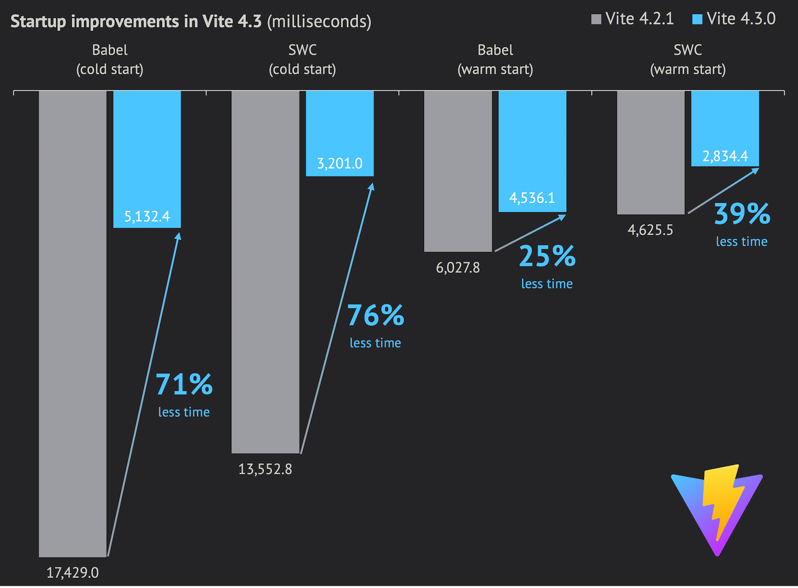
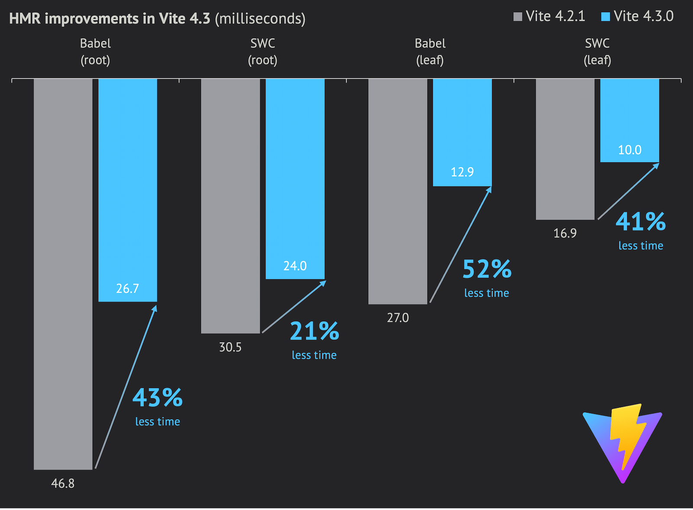

# Vite 4.3이 출시되었습니다! {#vite-4-3-is-out}

_2023년 4월 20일_

빠른 링크:

- 문서: [English](/), [简体中文](https://cn.vite.dev/), [日本語](https://ja.vite.dev/), [Español](https://es.vite.dev/), [Português](https://pt.vite.dev/)
- [Vite 4.3 변경 사항](https://github.com/vitejs/vite/blob/main/packages/vite/CHANGELOG.md#430-2023-04-20)

## 성능 향상 {#performance-improvements}

이번 마이너 릴리스에서는 개발 서버 성능 향상에 집중했습니다. 리졸버 로직을 간소화하여 핫 패스를 개선하고, `package.json`, TypeScript 설정 파일, 그리고 일반적인 URL 해석을 위한 더 스마트한 캐싱을 구현했습니다.

Vite 기여자 중 한 명이 작성한 이 블로그 포스트에서 성능 작업에 대한 자세한 설명을 읽을 수 있습니다: [How we made Vite 4.3 faaaaster 🚀](https://sun0day.github.io/blog/vite/why-vite4_3-is-faster.html).

이번 스프린트는 Vite 4.2와 비교하여 전반적인 속도 향상을 가져왔습니다.

다음은 [sapphi-red/performance-compare](https://github.com/sapphi-red/performance-compare)로 측정한 성능 향상 결과입니다. 이 도구는 1000개의 React 컴포넌트가 있는 앱을 대상으로 콜드 및 웜 개발 서버 시작 시간과 루트 및 리프 컴포넌트의 HMR 시간을 테스트합니다:

| **Vite (babel)**   |  Vite 4.2 | Vite 4.3 | 향상 |
| :----------------- | --------: | -------: | ----------: |
| **dev cold start** | 17249.0ms | 5132.4ms |      -70.2% |
| **dev warm start** |  6027.8ms | 4536.1ms |      -24.7% |
| **Root HMR**       |    46.8ms |   26.7ms |      -42.9% |
| **Leaf HMR**       |    27.0ms |   12.9ms |      -52.2% |

| **Vite (swc)**     |  Vite 4.2 | Vite 4.3 | 향상 |
| :----------------- | --------: | -------: | ----------: |
| **dev cold start** | 13552.5ms | 3201.0ms |      -76.4% |
| **dev warm start** |  4625.5ms | 2834.4ms |      -38.7% |
| **Root HMR**       |    30.5ms |   24.0ms |      -21.3% |
| **Leaf HMR**       |    16.9ms |   10.0ms |      -40.8% |

벤치마크에 대한 자세한 정보는 [여기](https://gist.github.com/sapphi-red/25be97327ee64a3c1dce793444afdf6e)에서 확인할 수 있습니다. 이 성능 테스트의 사양과 버전:

- CPU: Ryzen 9 5900X, Memory: DDR4-3600 32GB, SSD: WD Blue SN550 NVME SSD
- Windows 10 Pro 21H2 19044.2846
- Node.js 18.16.0
- Vite 및 React 플러그인 버전
  - Vite 4.2 (babel): Vite 4.2.1 + plugin-react 3.1.0
  - Vite 4.3 (babel): Vite 4.3.0 + plugin-react 4.0.0-beta.1
  - Vite 4.2 (swc): Vite 4.2.1 + plugin-react-swc 3.2.0
  - Vite 4.3 (swc): Vite 4.3.0 + plugin-react-swc 3.3.0

얼리 어답터들도 Vite 4.3 베타를 테스트하면서 실제 앱에서 1.5x-2x의 개발 시작 시간 향상을 보고했습니다. 여러분의 앱에서의 결과를 알려주시면 좋겠습니다.

## 프로파일링 {#profiling}

Vite의 성능 향상 작업을 계속 진행할 예정입니다. 각 Pull Request에 대한 성능 메트릭을 얻을 수 있는 공식 [벤치마크 도구](https://github.com/vitejs/vite-benchmark)를 작업하고 있습니다.

그리고 [vite-plugin-inspect](https://github.com/antfu/vite-plugin-inspect)는 이제 어떤 플러그인이나 미들웨어가 애플리케이션의 병목인지 식별하는 데 도움이 되는 더 많은 성능 관련 기능을 제공합니다.

페이지가 로드된 후 `vite --profile`을 사용하고 (그 다음 `p`를 누르면) 개발 서버 시작의 CPU 프로파일이 저장됩니다. [speedscope](https://www.speedscope.app/)와 같은 앱에서 열어 성능 문제를 식별할 수 있습니다. 그리고 [Discussion](https://github.com/vitejs/vite/discussions)이나 [Vite Discord](https://chat.vite.dev)에서 Vite 팀과 발견한 내용을 공유할 수 있습니다.

## 다음 단계 {#next-steps}

올해는 9월에 있을 [Node.js 16의 EOL](https://endoflife.date/nodejs)에 맞춰 단일 Vite 메이저 버전을 한 번만 출시하기로 결정했으며, 이 릴리스에서 Node.js 14와 16 모두에 대한 지원을 중단할 예정입니다. 참여하고 싶으시다면, 초기 피드백을 수집하기 위해 [Vite 5 Discussion](https://github.com/vitejs/vite/discussions/12466)을 시작했습니다.