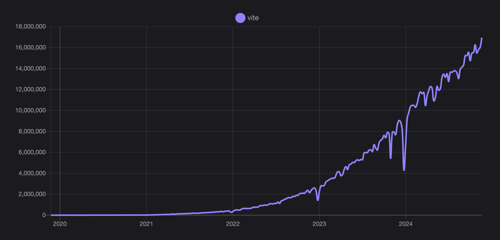

# Vite 6.0이 출시되었습니다! {#vite-6-0-is-out}

_2024년 11월 26일_

오늘, 저희는 Vite의 이야기에서 또 다른 큰 발걸음을 내딛게 되었습니다. Vite [팀](/team), [기여자들](https://github.com/vitejs/vite/graphs/contributors), 그리고 생태계 파트너들은 Vite 6의 출시를 발표하게 되어 기쁩니다.

올해는 정말 다사다난한 한 해였습니다. Vite의 채택률이 계속 증가하여, 1년 전 Vite 5가 출시된 이후 주간 npm 다운로드가 750만 건에서 1,700만 건으로 급증했습니다. [Vitest](https://vitest.dev)는 사용자들에게 더욱 선호받을 뿐만 아니라 자체적인 생태계를 형성하기 시작했습니다. 예를 들어, [Storybook](https://storybook.js.org)은 Vitest로 구동되는 새로운 테스트 기능을 갖추고 있습니다.

[TanStack Start](https://tanstack.com/start), [One](https://onestack.dev/), [Ember](https://emberjs.com/) 등을 포함한 새로운 프레임워크들도 Vite 생태계에 합류했습니다. 웹 프레임워크들은 점점 더 빠른 속도로 혁신하고 있습니다. [Astro](https://astro.build/), [Nuxt](https://nuxt.com/), [SvelteKit](https://kit.svelte.dev/), [Solid Start](https://www.solidjs.com/blog/introducing-solidstart), [Qwik City](https://qwik.builder.io/qwikcity/overview/), [RedwoodJS](https://redwoodjs.com/), [React Router](https://reactrouter.com/) 등에서 사람들이 해온 개선사항들을 확인해보실 수 있습니다.

Vite는 OpenAI, Google, Apple, Microsoft, NASA, Shopify, Cloudflare, GitLab, Reddit, Linear 등 많은 기업에서 사용되고 있습니다. 두 달 전, 저희는 [Vite를 사용하는 기업들](https://github.com/vitejs/companies-using-vite) 목록을 시작했습니다. 많은 개발자들이 자신들의 회사를 목록에 추가하기 위해 PR을 보내주시는 것을 보니 기쁩니다. Vite가 첫 걸음을 내딛은 이후 함께 구축한 생태계가 이렇게 크게 성장한 것이 믿기 어려울 정도입니다.

## Vite 생태계 가속화 {#speeding-up-the-vite-ecosystem}

지난달, 커뮤니티는 [StackBlitz](https://stackblitz.com)가 다시 한 번 주최한 세 번째 [ViteConf](https://viteconf.org/24/replay)에 모였습니다. 이는 생태계 빌더들의 폭넓은 참여로 가장 큰 Vite 컨퍼런스였습니다. 다른 발표들 중에서도, Evan You는 JavaScript 생태계를 위한 오픈소스, 고성능, 통합 개발 툴체인 구축에 전념하는 회사인 [VoidZero](https://staging.voidzero.dev/posts/announcing-voidzero-inc)를 발표했습니다. VoidZero는 [Rolldown](https://rolldown.rs)과 [Oxc](https://oxc.rs)를 뒷받침하고 있으며, 그들의 팀은 Vite에서 채택될 수 있도록 빠르게 준비시키며 상당한 진전을 이루고 있습니다. Vite의 Rust 기반 미래에 대한 다음 단계를 더 자세히 알아보려면 Evan의 기조연설을 시청해보세요.

<YouTubeVideo videoId="EKvvptbTx6k?si=EZ-rFJn4pDW3tUvp" />

[Stackblitz](https://stackblitz.com)는 Claude와 WebContainers를 결합하여 풀스택 앱을 프롬프트, 편집, 실행, 배포할 수 있게 해주는 Remix 앱인 [bolt.new](https://bolt.new)를 공개했습니다. Nate Weiner는 웹과 네이티브를 위한 새로운 Vite 기반 React 프레임워크인 [One](https://onestack.dev/)을 발표했습니다. Storybook은 최신 Vitest 기반 [테스트 기능](https://youtu.be/8t5wxrFpCQY?si=PYZoWKf-45goQYDt)을 선보였습니다. 그리고 훨씬 더 많은 것들이 있었습니다. [총 43개의 발표](https://www.youtube.com/playlist?list=PLqGQbXn_GDmnObDzgjUF4Krsfl6OUKxtp)를 모두 시청하시기를 권장합니다. 발표자들은 각 프로젝트가 무엇을 해왔는지 저희와 공유하기 위해 상당한 노력을 기울였습니다.

Vite는 또한 새로운 랜딩 페이지와 깔끔한 도메인을 얻었습니다. 앞으로는 새로운 [vite.dev](https://vite.dev) 도메인을 가리키도록 URL을 업데이트해야 합니다. 새로운 디자인과 구현은 VoidZero에서, 그들의 웹사이트를 만든 동일한 분들이 작업했습니다. [Vicente Rodriguez](https://bento.me/rmoon)와 [Simon Le Marchant](https://marchantweb.com/)에게 감사드립니다.

## 다음 Vite 메이저가 여기에 있습니다 {#the-next-vite-major-is-here}

Vite 6는 Vite 2 이후 가장 중요한 메이저 릴리스입니다. 저희는 새로운 API를 통해 공유 커먼즈를 계속 확장하고, 평소와 같이 구축할 수 있는 더욱 세련된 기반을 제공하기 위해 생태계와 파트너십을 맺기를 열망합니다.

빠른 링크:

- [문서](/)
- 번역: [简体中文](https://cn.vite.dev/), [日本語](https://ja.vite.dev/), [Español](https://es.vite.dev/), [Português](https://pt.vite.dev/), [한국어](https://ko.vite.dev/), [Deutsch](https://de.vite.dev/)
- [마이그레이션 가이드](/guide/migration)
- [GitHub 변경 사항](https://github.com/vitejs/vite/blob/main/packages/vite/CHANGELOG.md#600-2024-11-26)

Vite를 처음 사용하신다면, 먼저 [시작하기](/guide/) 및 [기능](/guide/features) 가이드를 읽어보시기 바랍니다.

이 새로운 메이저를 만드는 데 도움을 준 [Vite Core의 1,000명 이상의 기여자들](https://github.com/vitejs/vite/graphs/contributors)과 Vite 플러그인, 통합, 도구, 번역의 유지보수자 및 기여자들에게 감사드립니다. 참여하여 전체 생태계를 위한 Vite 개선에 도움을 주시기 바랍니다. 자세한 내용은 [기여 가이드](https://github.com/vitejs/vite/blob/main/CONTRIBUTING.md)에서 확인하세요.

시작하려면 [이슈 분류](https://github.com/vitejs/vite/issues), [PR 리뷰](https://github.com/vitejs/vite/pulls), 열린 이슈를 기반으로 한 실패 테스트 PR 전송, [Discussions](https://github.com/vitejs/vite/discussions)와 Vite Land의 [도움 포럼](https://discord.com/channels/804011606160703521/1019670660856942652)에서 다른 사람들 지원을 도와주시기 바랍니다. 저희와 대화하고 싶으시다면, [Discord 커뮤니티](http://chat.vite.dev/)에 참여하여 [#contributing 채널](https://discord.com/channels/804011606160703521/804439875226173480)에서 인사해주세요.

Vite 생태계와 Vite 코어에 대한 최신 뉴스는 [Bluesky](https://bsky.app/profile/vite.dev), [X](https://twitter.com/vite_js), 또는 [Mastodon](https://webtoo.ls/@vite)에서 저희를 팔로우해주세요.

## Vite 6 시작하기 {#getting-started-with-vite-6}

`pnpm create vite`를 사용하여 선호하는 프레임워크로 Vite 앱을 빠르게 스캐폴딩하거나 [vite.new](https://vite.new)를 사용하여 Vite 6를 온라인으로 체험해볼 수 있습니다. 또한 `pnpm create vite-extra`를 실행하여 다른 프레임워크와 런타임(Solid, Deno, SSR, 라이브러리 스타터)의 템플릿에 액세스할 수 있습니다. `create vite-extra` 템플릿은 `create vite`를 실행할 때 `Others` 옵션에서도 사용할 수 있습니다.

Vite 스타터 템플릿은 다양한 프레임워크로 Vite를 테스트하는 플레이그라운드로 사용하기 위한 것입니다. 다음 프로젝트를 구축할 때는 각 프레임워크에서 권장하는 스타터를 사용해야 합니다. `create vite`는 또한 `create-vue`, `Nuxt 3`, `SvelteKit`, `Remix`, `Analog`, `Angular`와 같은 일부 프레임워크의 적절한 스타터를 설정하는 바로가기를 제공합니다.

## Node.js 지원 {#node-js-support}

Vite 6는 Vite 5와 유사하게 Node.js 18, 20, 22+를 지원합니다. Node.js 21 지원은 중단되었습니다. Vite는 [EOL](https://endoflife.date/nodejs) 이후 이전 버전에 대한 Node.js 지원을 중단합니다. Node.js 18 EOL은 2025년 4월 말이며, 그 이후에는 필요한 Node.js 버전을 높이기 위해 새로운 메이저를 출시할 수 있습니다.

## 실험적 Environment API {#experimental-environment-api}

Vite는 새로운 Environment API로 더욱 유연해지고 있습니다. 이러한 새로운 API를 통해 프레임워크 개발자들은 프로덕션에 더 가까운 개발 경험을 제공하고 생태계가 새로운 빌딩 블록을 공유할 수 있게 됩니다. SPA를 구축하는 경우에는 아무것도 변경되지 않습니다. 단일 클라이언트 환경에서 Vite를 사용할 때는 모든 것이 이전과 같이 작동합니다. 그리고 커스텀 SSR 앱의 경우에도 Vite 6는 하위 호환성을 유지합니다. Environment API의 주요 대상 사용자는 프레임워크 개발자들입니다.

궁금한 최종 사용자들을 위해, [Sapphi](https://github.com/sapphi-red)가 훌륭한 [Environment API 소개](https://green.sapphi.red/blog/increasing-vites-potential-with-the-environment-api) 가이드를 작성했습니다. 이는 시작하기에 좋은 곳이며 저희가 왜 Vite를 더욱 유연하게 만들려고 하는지 이해할 수 있습니다.

프레임워크 개발자이거나 Vite 플러그인 유지보수자이고 새로운 API를 활용하고 싶으시다면, [Environment API 가이드](https://main.vite.dev/guide/api-environment)에서 더 자세히 알아보실 수 있습니다.

새로운 API를 정의하고 구현하는 데 참여한 모든 분들에게 감사드립니다. 이 이야기는 [Rich Harris](https://github.com/Rich-Harris)와 [SvelteKit](https://svelte.dev/docs/kit) 팀이 개척한 언번들드 SSR 개발 스킴을 Vite 2가 채택하면서 시작됩니다. 그 후 Vite의 SSR 변환이 [Anthony Fu](https://github.com/antfu/)와 [Pooya Parsa](https://github.com/pi0)가 vite-node를 만들고 [Nuxt의 Dev SSR 스토리](https://antfu.me/posts/dev-ssr-on-nuxt)를 개선할 수 있게 해주었습니다. Anthony는 vite-node를 사용하여 [Vitest](https://vitest.dev)를 구동했고, [Vladimir Sheremet](https://github.com/sheremet-va)는 Vitest 유지보수 작업의 일환으로 계속 개선했습니다. 2023년 초, Vladimir는 vite-node를 Vite Core로 업스트림하는 작업을 시작했고, 1년 후 Vite 5.1에서 Runtime API로 출시했습니다. 생태계 파트너들(특히 Cloudflare 팀에게 감사드립니다)의 피드백은 저희가 Vite의 환경에 대해 더욱 야심찬 재작업을 하도록 이끌었습니다. 이 이야기에 대해 더 자세히 알아보려면 [Patak의 ViteConf 24 발표](https://www.youtube.com/watch?v=WImor3HDyqU?si=EZ-rFJn4pDW3tUvp)를 참조하세요.

Vite 팀의 모든 구성원이 새로운 API 정의에 참여했으며, 이는 생태계의 많은 프로젝트들의 피드백과 함께 공동 설계되었습니다. 참여해주신 모든 분들께 감사드립니다! Vite 위에 프레임워크, 플러그인, 도구를 구축하고 계시다면 참여하시기 바랍니다. 새로운 API는 실험적입니다. 저희는 생태계와 협력하여 새로운 API가 어떻게 사용될지 검토하고 다음 메이저를 위해 안정화할 것입니다. 질문하거나 피드백을 주고 싶으시다면, [여기에 열린 GitHub 토론](https://github.com/vitejs/vite/discussions/16358)이 있습니다.

## 주요 변경사항 {#main-changes}

- [`resolve.conditions`의 기본값](/guide/migration#default-value-for-resolve-conditions)
- [JSON stringify](/guide/migration#json-stringify)
- [HTML 요소의 애셋 참조에 대한 확장 지원](/guide/migration#extended-support-of-asset-references-in-html-elements)
- [postcss-load-config](/guide/migration#postcss-load-config)
- [Sass가 이제 기본적으로 modern API를 사용](/guide/migration#sass-now-uses-modern-api-by-default)
- [라이브러리 모드에서 CSS 출력 파일명 커스터마이징](/guide/migration#customize-css-output-file-name-in-library-mode)
- [그리고 소수 사용자에게만 영향을 미칠 더 많은 변경사항들](/guide/migration#advanced)

또한 Vite의 모든 계획된, 고려 중인, 과거 변경사항들을 나열하는 새로운 [주요 변경사항](/changes/) 페이지도 있습니다.

## Vite 6로 마이그레이션 {#migrating-to-vite-6}

대부분의 프로젝트에서 Vite 6로의 업데이트는 간단해야 하지만, 업그레이드하기 전에 [상세한 마이그레이션 가이드](/guide/migration)를 검토하시기 바랍니다.

전체 변경사항 목록은 [Vite 6 변경 사항](https://github.com/vitejs/vite/blob/main/packages/vite/CHANGELOG.md#500-2024-11-26)에서 확인하실 수 있습니다.

## 감사의 말 {#acknowledgments}

Vite 6는 기여자 커뮤니티, 다운스트림 유지보수자들, 플러그인 개발자들, 그리고 [Vite 팀](/team)의 오랜 작업 시간의 결과입니다. Vite 개발을 후원하는 개인과 기업들에게 감사드립니다. Vite는 [StackBlitz](https://stackblitz.com/), [Nuxt Labs](https://nuxtlabs.com/), [Astro](https://astro.build)와의 파트너십으로 [VoidZero](https://voidzero.dev)에서 제공합니다. [Vite의 GitHub Sponsors](https://github.com/sponsors/vitejs)와 [Vite의 Open Collective](https://opencollective.com/vite)의 후원자들에게 감사드립니다.