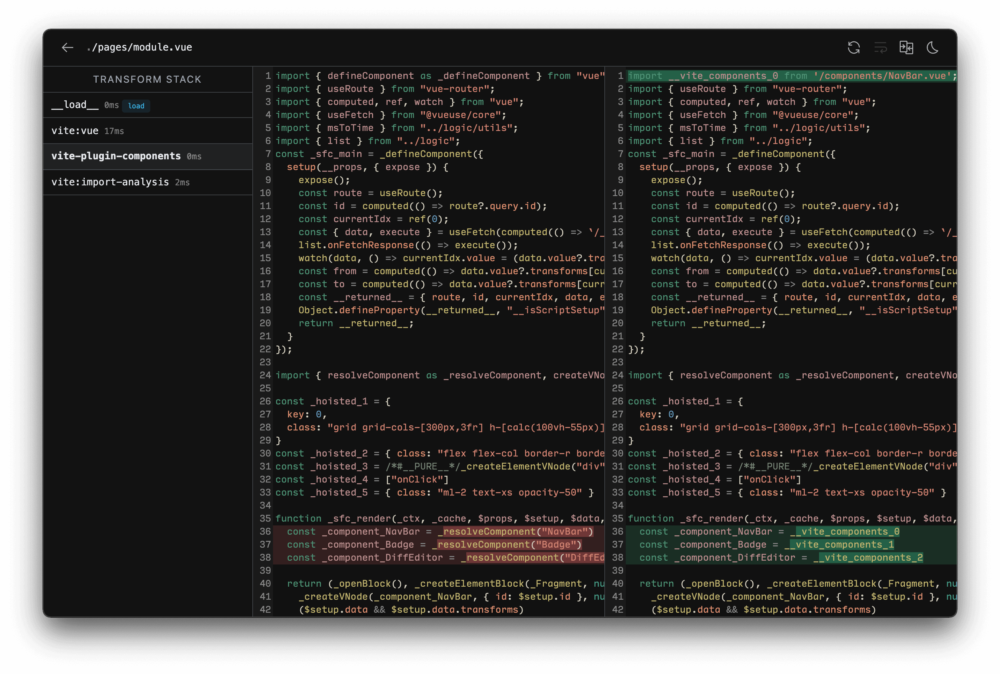

# 플러그인 API {#plugin-api}

Vite의 플러그인은 Rollup의 멋진 플러그인 인터페이스에 몇 가지 Vite 특정 옵션을 추가한 형태로 구성하였습니다. 그리고 결과적으로, Vite의 플러그인은 한 번 작성되면 개발 및 빌드 시 모두 사용이 가능하다는 장점이 있죠.

**아래 내용은 [Rollup의 플러그인 문서](https://rollupjs.org/plugin-development/)를 읽었다는 전제 하에 진행합니다.**

## 플러그인 만들기 {#authoring-a-plugin}

Vite strives to offer established patterns out of the box, so before creating a new plugin make sure that you check the [Features guide](/guide/features) to see if your need is covered. Also review available community plugins, both in the form of a [compatible Rollup plugin](https://github.com/rollup/awesome) and [Vite Specific plugins](https://github.com/vitejs/awesome-vite#plugins)

플러그인을 만들 때는 굳이 새로운 패키지를 만들지 않고 `vite.config.js`에 직접 작성할 수도 있습니다. 만약 작성한 플러그인이 프로젝트에서 유용하다고 생각된다면, [Vite를 사용하는 다른 사람들과 공유해보세요](https://chat.vite.dev).

::: tip
플러그인을 학습하거나, 디버깅 또는 새롭게 작성할 때, 프로젝트에 [vite-plugin-inspect](https://github.com/antfu/vite-plugin-inspect)를 설치하는 것이 좋습니다. 이 모듈은 `localhost:5173/__inspect/`를 통해 Vite 플러그인의 중간 상태를 검사할 수 있도록 도와줍니다. 더 자세한 사항은 [vite-plugin-inspect 문서](https://github.com/antfu/vite-plugin-inspect)를 참고해주세요.

:::

## 플러그인 작성 규칙 {#conventions}

만약 플러그인이 Vite에서 제공하는 훅을 사용하지 않고, 또 [호환되는 Rollup 플러그인](#rollup-plugin-compatibility)으로 구성될 수 있는 경우에는 [Rollup 플러그인 명명 규칙](https://rollupjs.org/plugin-development/#conventions)을 따르는 것이 좋습니다.

- Rollup 플러그인은 `rollup-plugin-` 접두사가 있는 명확한 이름을 갖습니다.
- package.json 파일의 `keywords` 항목에는 `rollup-plugin` 및 `vite-plugin`을 포함시키도록 합니다.

위 규칙을 통해 작성된 플러그인이 순수하게 Rollup이나 [WMR](https://github.com/preactjs/wmr) 기반의 프로젝트에서도 사용될 수 있도록 도와줍니다.

플러그인이 Vite 전용으로 작성된 경우에는 아래 규칙을 따라주세요.

- Vite 플러그인은 `vite-plugin-` 접두사가 있는 명확한 이름을 갖습니다.
- package.json 파일의 `keywords` 항목에는 `vite-plugin`을 포함시키도록 합니다.
- 플러그인 문서에 Vite 플러그인으로 구성한 이유를 설명하는 섹션을 추가합니다. (가령 'Vite 전용 플러그인 훅 사용'과 같이 말이죠.)

특정 프레임워크에서만 동작하는 Vite 플러그인은 프레임워크의 이름이 접두사의 일부로 포함되도록 합니다.

- `vite-plugin-vue-`는 Vue만을 지원하는 Vite 플러그인을 의미합니다.
- `vite-plugin-react-`는 React만을 지원하는 Vite 플러그인을 의미합니다.
- `vite-plugin-svelte-`는 Svelte만을 지원하는 Vite 플러그인을 의미합니다.

[가상 모듈 컨벤션](#virtual-modules-convention)또한 참고가 가능합니다.

## 플러그인 설정 {#plugins-config}

프로젝트의 `devDependencies`에 플러그인을 추가한 뒤, Vite 설정 파일의 `plugins` 배열 옵션을 사용해 플러그인을 구성할 수 있습니다.

```js [vite.config.js]
import vitePlugin from 'vite-plugin-feature'
import rollupPlugin from 'rollup-plugin-feature'

export default defineConfig({
  plugins: [vitePlugin(), rollupPlugin()]
})
```

다른 플러그인을 쉽게 활성화하거나 비활성화하는 데 사용될 수 있는 잘못된 플러그인은 무시됩니다.

`plugins` 항목은 여러 플러그인을 하나의 요소로 포함할 수도 있습니다. 이는 특정 프레임워크를 타깃으로 여러 플러그인을 사용하는 경우와 같이 복잡한 기능을 구현하는 데 유용합니다. 이 때 플러그인 배열은 자동으로 병합됩니다.

```js
// framework-plugin
import frameworkRefresh from 'vite-plugin-framework-refresh'
import frameworkDevtools from 'vite-plugin-framework-devtools'

export default function framework(config) {
  return [frameworkRefresh(config), frameworkDevTools(config)]
}
```

```js [vite.config.js]
import { defineConfig } from 'vite'
import framework from 'vite-plugin-framework'

export default defineConfig({
  plugins: [framework()]
})
```

## 간단한 예제들 {#simple-examples}

:::tip
Vite 또는 Rollup 플러그인을 구현할 때는 실제 플러그인 객체를 반환하는 팩토리 함수로 작성하는 것이 일반적인 관례입니다. 또한 이렇게 구성할 경우 플러그인을 사용하는 사용자가 플러그인의 세부적인 동작을 정의할 수 있는 옵션을 허용할 수 있게 만들어 줄 수도 있습니다.
:::

### 파일 타입 변환하기 {#transforming-custom-file-types}

```js
const fileRegex = /\.(my-file-ext)$/

export default function myPlugin() {
  return {
    name: 'transform-file',

    transform(src, id) {
      if (fileRegex.test(id)) {
        return {
          code: compileFileToJS(src),
          map: null // 가능하다면 소스 맵을 제공
        }
      }
    }
  }
}
```

### 가상 모듈 가져오기 {#importing-a-virtual-file}

예제는 [다음 섹션](#virtual-modules-convention)을 참고해주세요.

## 가상 모듈 컨벤션 {#virtual-modules-convention}

가상 모듈은 ESM의 일반적인 `import` 구문을 사용해 소스 파일에 빌드 시의 정보를 전달할 수 있는 유용한 기법입니다.

```js
export default function myPlugin() {
  const virtualModuleId = 'virtual:my-module'
  const resolvedVirtualModuleId = '\0' + virtualModuleId

  return {
    name: 'my-plugin', // 필수 항목이며, 경고나 오류를 나타낼 때 사용됩니다.
    resolveId(id) {
      if (id === virtualModuleId) {
        return resolvedVirtualModuleId
      }
    },
    load(id) {
      if (id === resolvedVirtualModuleId) {
        return `export const msg = "from virtual module"`
      }
    }
  }
}
```

JavaScript에서는 다음과 같이 모듈을 가져올 수 있습니다:

```js
import { msg } from 'virtual:my-module'

console.log(msg)
```

[가상 모듈](https://rollupjs.org/plugin-development/#a-simple-example)은 Vite와 Rollup에서 `virtual:` 접두사를 붙여 표현 및 사용합니다. 또한, 가능한 플러그인의 이름을 네임스페이스로 사용하여 다른 플러그인과의 충돌을 방지해야 합니다. 가령 `vite-plugin-posts` 라는 이름을 가진 플러그인이 있고, 이 플러그인을 사용하는 사용자는 가상 모듈을 포함(Import)해야 한다고 가정하겠습니다. 이 때 가상 모듈의 이름은 `virtual:posts` 또는 `virtual:posts/helpers`와 같이 플러그인 이름인 `posts`를 사용하는 것이 적절합니다. 그리고 이름 규칙에 대해 내부적으로 보자면, 가상 모듈을 사용하는 플러그인은 Rollup의 규칙과 같이 모듈의 ID를 확인하는 과정에서 ID 앞에 `\0`을 붙여줘야 합니다. 이는 다른 플러그인이 노드를 확인하는 작업(Node Resolution) 등과 같이 가상 모듈의 ID를 처리하는 것을 방지하고, 또 소스 맵과 같은 핵심 기능에서는 가상 모듈과 일반 모듈을 구별하기 위해 사용하기 때문입니다. 다만 `\0`은 `import` 시 사용되는 URL에서 허용되는 문자가 아니기에, `import` 분석 중에는 이 문자열을 대체해줘야 합니다. 브라우저에서는 `\0{id}` 라는 ID가 `/@id/__x00__{id}`로 인코딩되며, 이 ID는 플러그인 파이프라인을 진행하기 전 다시 디코딩되기에 플러그인 훅 내부에서는 이를 볼 수 없습니다.

단일 파일 컴포넌트(Single File Component, .vue 나 .svelte 확장자가 붙은)와 같이 실제 파일을 기반으로 만들어진 모듈의 경우에는 위 규칙을 따를 필요가 없습니다. 특히 SFC는 일반적으로 하위 모듈들을 생성하는 방식으로 처리되나, 이들의 코드는 파일 시스템에 다시 매핑될 수 있습니다. 이 하위 모듈에 `\0`을 사용하게 되면 소스 맵이 정상적으로 동작하지 않습니다.

## 범용 훅 {#universal-hooks}

개발 시, Vite 개발 서버는 Rollup과 동일한 방식으로 [Rollup 빌드 훅](https://rollupjs.org/plugin-development/#build-hooks)을 호출하는 플러그인 컨테이너를 생성합니다.

아래의 훅은 서버 시작 시 호출됩니다:

- [`options`](https://rollupjs.org/plugin-development/#options)
- [`buildStart`](https://rollupjs.org/plugin-development/#buildstart)

아래의 훅은 모듈을 요청할 때마다 호출됩니다:

- [`resolveId`](https://rollupjs.org/plugin-development/#resolveid)
- [`load`](https://rollupjs.org/plugin-development/#load)
- [`transform`](https://rollupjs.org/plugin-development/#transform)

이 훅에는 Vite 전용 속성이 존재하는 확장된 `options` 매개변수가 있습니다. 자세한 내용은 [SSR 문서](/guide/ssr#ssr-specific-plugin-logic)에서 확인할 수 있습니다.

일부 `resolveId` 호출의 `importer` 값은 루트의 일반적인 `index.html`에 대한 절대 경로일 수 있습니다. 이는 Vite의 번들되지 않은 개발 서버 패턴으로 인해 실제 Importer를 도출하는 것이 항상 가능한 것은 아니기 때문입니다. 다만 Vite의 리졸브 파이프라인 내에서 처리되는 Import의 경우, Import 분석 단계에서 Importer를 추적할 수 있기에, 올바른 `importer` 값을 제공할 수 있습니다.

아래의 훅은 서버가 종료될 때 호출됩니다:

- [`buildEnd`](https://rollupjs.org/plugin-development/#buildend)
- [`closeBundle`](https://rollupjs.org/plugin-development/#closebundle)

참고로 Vite는 더 효율적인 동작을 위해 전체 소스에 대한 AST 구문 분석을 진행하지 않기에, [`moduleParsed`](https://rollupjs.org/plugin-development/#moduleparsed) 훅은 **개발 과정에서 호출되지 않습니다**.

[Output Generation Hooks](https://rollupjs.org/plugin-development/#output-generation-hooks) 또한 `closeBundle`을 제외하고 **개발 과정에서는 호출되지 않습니다**. Vite의 개발 서버가 `bundle.generate()`를 호출하지 않고 `rollup.rollup()`만을 호출한다는 것으로 생각하면 됩니다.

## Vite 전용 훅 {#vite-specific-hooks}

Vite의 플러그인은 Vite 전용 훅을 사용할 수 있습니다. 물론 이러한 훅은 Rollup에서 무시됩니다.

### `config` {#config}

- **타입:** `(config: UserConfig, env: { mode: string, command: string }) => UserConfig | null | void`
- **종류:** `async`, `sequential`

  훅을 이용해 Vite의 설정을 실제 사용하기 전 변경할 수 있습니다. `config` 훅으로 설정 파일 또는 CLI 옵션으로 전달받은 로우 레벨 사용자 설정 값과, 현재 사용 중인 `mode` 및 `command`가 인자를 통해 전달됩니다. 훅은 객체를 반환할 수 있으며, 이 때의 객체는 기존 설정에 대해 깊은 병합(Deeply merge)이 됩니다. 또는 인자로 전달받은 설정 객체를 직접 수정할 수도 있습니다. 다만 이 방법은 객체 반환을 이용한 방법으로는 원하는 결과를 얻을 수 없을 때만 사용하세요.

  **예제:**

  ```js
  // 설정 값 일부를 반환 (권고)
  const partialConfigPlugin = () => ({
    name: 'return-partial',
    config: () => ({
      resolve: {
        alias: {
          foo: 'bar'
        }
      }
    })
  })

  // 전달받은 설정 객체를 직접 수정 (위 방법으로 불가능할 때 사용)
  const mutateConfigPlugin = () => ({
    name: 'mutate-config',
    config(config, { command }) {
      if (command === 'build') {
        config.root = 'foo'
      }
    }
  })
  ```

  ::: warning 참고
  `config` 훅 안에서 다른 플러그인을 사용하지 마세요. 플러그인 자체는 이 훅이 실행되기 전에 모두 확정(Resolve)되며, 따라서 아무런 효과가 없습니다.
  :::

### `configResolved` {#configresolved}

- **타입:** `(config: ResolvedConfig) => void | Promise<void>`
- **종류:** `async`, `parallel`

  Vite 설정 값이 확정된 후 호출되는 훅입니다. 이 훅을 사용하여 최종적으로 확정된 설정 값을 읽거나 저장할 수 있습니다. 특히 플러그인이 실행 중인 명령에 따라 다른 작업을 수행해야 하는 경우 유용합니다.

  **예제:**

  ```js
  const examplePlugin = () => {
    let config

    return {
      name: 'read-config',

      configResolved(resolvedConfig) {
        // 확정된 설정 값을 저장
        config = resolvedConfig
      },

      // 다른 훅에서 저장된 설정 값을 이용
      transform(code, id) {
        if (config.command === 'serve') {
          // dev: 개발 서버에서의 플러그인 행동 정의
        } else {
          // build: Rollup 시 플러그인 행동 정의
        }
      }
    }
  }
  ```

  참고로 `command` 값은 개발 서버에서 `serve` 입니다(cli에서 `vite`, `vite dev` 및 `vite serve` 모두 별칭입니다).

### `configureServer` {#configureserver}

- **타입:** `(server: ViteDevServer) => (() => void) | void | Promise<(() => void) | void>`
- **종류:** `async`, `sequential`
- **관련 항목:** [ViteDevServer](./api-javascript#vitedevserver)

  개발 서버를 구성하기 위한 훅입니다. 일반적으로 커스텀 미들웨어를 내부의 [connect](https://github.com/senchalabs/connect) 앱에 추가하기 위해 사용합니다:

  ```js
  const myPlugin = () => ({
    name: 'configure-server',
    configureServer(server) {
      server.middlewares.use((req, res, next) => {
        // 이 곳에서 원하는 방식으로 요청을 핸들링 할 수 있습니다
      })
    }
  })
  ```

  **내부 미들웨어 설치 이후에 호출되는 커스텀 미들웨어 구성하기**

  `configureServer` 훅은 내부의 미들웨어가 설치되기 전 호출됩니다. 따라서 위와 같은 방식의 커스텀 미들웨어는 내부의 미들웨어보다 먼저 실행됩니다. 만약 내부의 미들웨어가 설치된 **이후에** 커스텀 미들웨어를 호출하고자 한다면, `configureServer`의 반환 값으로 함수를 반환해주세요:

  ```js
  const myPlugin = () => ({
    name: 'configure-server',
    configureServer(server) {
      // 내부 미들웨어가 설치된 후
      // 실행될 훅을 반환합니다
      return () => {
        server.middlewares.use((req, res, next) => {
          // 이 곳에서 원하는 방식으로 요청을 핸들링 할 수 있습니다
        })
      }
    },
  })
  ```

  **서버 인스턴스 저장하기**

  In some cases, other plugin hooks may need access to the dev server instance (e.g. accessing the WebSocket server, the file system watcher, or the module graph). This hook can also be used to store the server instance for access in other hooks:

  ```js
  const myPlugin = () => {
    let server
    return {
      name: 'configure-server',
      configureServer(_server) {
        server = _server
      },
      transform(code, id) {
        if (server) {
          // 서버 인스턴스 사용...
        }
      }
    }
  }
  ```

  참고로 `configureServer`는 프로덕션 버전으로 빌드할 때 호출되지 않으므로 위 예시와 같이 훅이 존재하지 않는 경우를 분기해줘야 합니다.

### `configurePreviewServer` {#configurepreviewserver}

- **타입:** `(server: PreviewServer) => (() => void) | void | Promise<(() => void) | void>`
- **종류:** `async`, `sequential`
- **관련 항목:** [PreviewServer](./api-javascript#previewserver)

  [`configureServer`](/guide/api-plugin.html#configureserver)와 같지만 프리뷰 서버에 대한 것입니다. `configureServer`와 마찬가지로 `configurePreviewServer` 훅은 다른 미들웨어가 설치되기 전에 호출됩니다. 만약 다른 미들웨어가 설치된 **이후에** 커스텀 미들웨어를 호출하고자 한다면, `configurePreviewServer`의 반환 값으로 함수를 반환해주세요. 이렇게 하면 내부 미들웨어가 설치된 후에 호출됩니다:

  ```js
  const myPlugin = () => ({
    name: 'configure-preview-server',
    configurePreviewServer(server) {
      // 다른 미들웨어가 설치된 후 호출되는 함수를 
      // 반환합니다
      return () => {
        server.middlewares.use((req, res, next) => {
          // 요청에 대한 커스텀 핸들러 코드
        })
      }
    },
  })
  ```

### `transformIndexHtml` {#transformindexhtml}

- **타입:** `IndexHtmlTransformHook | { order?: 'pre' | 'post', handler: IndexHtmlTransformHook }`
- **종류:** `async`, `sequential`

  `index.html`과 같은 진입점이 되는 HTML 파일을 변환하기 위한 훅입니다. 훅의 인자로는 HTML 문자열과 컨텍스트를 전달받습니다. 개발 서버의 경우 컨텍스트에 [`ViteDevServer`](./api-javascript#vitedevserver) 인스턴스를 함께 전달하며, 빌드 시에는 Rollup된 번들을 전달합니다.

  훅은 비동기적으로 동작할 수 있으며 다음 중 하나를 반환합니다:
  - 변환된 HTML 문자열
  - 기존 HTML에 추가할 태그 설명자 객체(`{ tag, attrs, children }`) 배열. 각 태그는 기본적으로 `<head>` 앞에 추가되지만, 이 위치를 지정할 수도 있습니다.
  - `{ html, tags }` 둘 다 포함하는 객체

  기본적으로 `order`는 `undefined`이며, HTML이 변환된 이후 훅이 적용됩니다. `order: 'pre'`는 Vite 플러그인 파이프라인을 거쳐야 하는 스크립트를 주입하기 위해 HTML을 변환하기 전 훅을 적용합니다. `order: 'post'`는 `order`가 정의되지 않은 모든 훅이 적용된 후에 훅을 적용합니다.

  **예제:**

  ```js
  const htmlPlugin = () => {
    return {
      name: 'html-transform',
      transformIndexHtml(html) {
        return html.replace(
          /<title>(.*?)<\/title>/,
          `<title>Title replaced!</title>`
        )
      },
    }
  }
  ```

  **훅 시그니처:**

  ```ts
  type IndexHtmlTransformHook = (
    html: string,
    ctx: {
      path: string
      filename: string
      server?: ViteDevServer
      bundle?: import('rollup').OutputBundle
      chunk?: import('rollup').OutputChunk
    }
  ) =>
    | IndexHtmlTransformResult
    | void
    | Promise<IndexHtmlTransformResult | void>

  type IndexHtmlTransformResult =
    | string
    | HtmlTagDescriptor[]
    | {
        html: string
        tags: HtmlTagDescriptor[]
      }

  interface HtmlTagDescriptor {
    tag: string
    attrs?: Record<string, string | boolean>
    children?: string | HtmlTagDescriptor[]
    /**
     * 기본값: 'head-prepend'
     */
    injectTo?: 'head' | 'body' | 'head-prepend' | 'body-prepend'
  }
  ```

::: warning 참고
이 훅은 진입점이 되는 파일을 커스텀 처리하는 프레임워크(예: [SvelteKit](https://github.com/sveltejs/kit/discussions/8269#discussioncomment-4509145))를 사용하는 경우 호출되지 않습니다.
:::

### `handleHotUpdate` {#handlehotupdate}

- **타입:** `(ctx: HmrContext) => Array<ModuleNode> | void | Promise<Array<ModuleNode> | void>`
- **Kind:** `async`, `sequential`
- **관련 항목:** [HMR API](./api-hmr)

  사용자가 지정한 방식대로 HMR 업데이트를 수행합니다. 이 훅은 아래와 같은 컨텍스트 객체를 전달받습니다:

  ```ts
  interface HmrContext {
    file: string
    timestamp: number
    modules: Array<ModuleNode>
    read: () => string | Promise<string>
    server: ViteDevServer
  }
  ```

  - `modules`는 변경된 파일의 영향을 받는 모듈의 배열입니다. Vue SFC와 같이 단일 파일이 여러 모듈에 매핑될 수 있기 때문에 배열 형태로 제공됩니다.

  - `read`는 파일을 읽어 그 내용을 반환하는 비동기 함수입니다. 일부 시스템에서 핫 리로딩 시 파일 변경 콜백이 너무 이르게 호출되어 `fs.readFile`로 빈 콘텐츠가 반환될 수 있기에(더 자세한 내용은 [hmr.ts](https://github.com/vitejs/vite/blob/5a111cedf31f579e3b8c8af5c4442d2e0cd5aa12/packages/vite/src/node/server/hmr.ts#L443) 파일을 참고해주세요. - 옮긴이), 이 함수를 통해 정상적으로 파일을 읽을 수 있도록 제공하고 있습니다.

  이 훅은 다음 동작을 할 수 있습니다:
  - 영향을 받는 모듈 목록을 필터링하고 범위를 좁혀 더 정확하게 HMR이 동작하도록 구성

  - 빈 배열을 반환하고 전체 리로드를 수행:

    ```js
    handleHotUpdate({ server, modules, timestamp }) {
      // 모듈을 수동으로 무효화합니다
      const invalidatedModules = new Set()
      for (const mod of modules) {
        server.moduleGraph.invalidateModule(
          mod,
          invalidatedModules,
          timestamp,
          true
        )
      }
      server.ws.send({ type: 'full-reload' })
      return []
    }
    ```

  - 빈 배열을 반환하고 클라이언트에게 커스텀 이벤트를 전송하여, 완전한 커스텀 HMR 처리를 수행:

    ```js
    handleHotUpdate({ server }) {
      server.ws.send({
        type: 'custom',
        event: 'special-update',
        data: {}
      })
      return []
    }
    ```

    위 커스텀 이벤트는 [HMR API](./api-hmr)를 사용하여 핸들러를 등록해야 합니다(이는 동일한 플러그인의 `transform` 훅에 주입될 수 있습니다):

    ```js
    if (import.meta.hot) {
      import.meta.hot.on('special-update', (data) => {
        // 커스텀 업데이트 수행
      })
    }
    ```

## 플러그인 순서 {#plugin-ordering}

Vite 플러그인은 Webpack 로더와 유사한 `enforce` 프로퍼티를 추가적으로 지정하여 플러그인 애플리케이션의 순서를 조정할 수 있습니다. `enforce` 값은 `"pre"` 또는 `"post"`로 지정할 수 있으며, 이를 통해 지정되는 플러그인 순서는 다음과 같습니다:

- 별칭
- `enforce: 'pre'`로 지정된 플러그인
- Vite 코어 플러그인
- enforce 값이 존재하지 않는 플러그인
- Vite 빌드 플러그인
- `enforce: 'post'`로 지정된 플러그인
- 빌드 후 실행되는 Vite의 플러그인 (minify, manifest, reporting)

참고로 이는 훅 순서를 지정하는 것과는 별개이며, [Rollup 훅](https://rollupjs.org/plugin-development/#build-hooks)과 같이 `order` 속성이 별도로 적용된다는 점에 유의하세요.

## 조건부 애플리케이션 {#conditional-application}

기본적으로 플러그인은 개발 서버 및 빌드 시 모두 호출됩니다. 만약 플러그인이 개발 조건부로 호출되어야 하는 경우, `apply` 프로퍼티를 사용하여 `'build'` 또는 `'serve'` 중에만 플러그인이 호출되도록 구성해주세요:

```js
function myPlugin() {
  return {
    name: 'build-only',
    apply: 'build' // 또는 'serve'
  }
}
```

보다 정확한 제어를 위해 함수를 사용할 수도 있습니다:

```js
apply(config, { command }) {
  // 빌드 시 적용되지만 SSR에는 적용되지 않는 플러그인
  return command === 'build' && !config.build.ssr
}
```

## Rollup 플러그인 호환성 {#rollup-plugin-compatibility}

`@rollup/plugin-alias` 또는 `@rollup/plugin-json`과 같이 상당한 수의 Rollup 플러그인이 Vite 플러그인으로도 사용될 수 있으나, 일부 Rollup 플러그인 훅의 경우 번들되지 않은 개발 서버에서는 의미가 없기에 전부 Vite 플러그인으로 사용할 수 있지는 않습니다.

일반적으로, Rollup 플러그인이 다음 기준에 부합한다면 Vite 플러그인으로도 사용이 가능합니다:

- [`moduleParsed`](https://rollupjs.org/plugin-development/#moduleparsed) 훅을 사용하지 않음
- 번들 단계의 훅과 번들링 이후 출력 단계의 훅 사이에 강력한 결합이 없음

만약 Rollup 플러그인이 빌드 단계에서만 의미가 있는 경우라면, `build.rollupOptions.plugins` 옵션에 해당 플러그인을 사용하도록 지정할 수 있습니다. 이는 `enforce: 'post'` 및 `apply: 'build'` 옵션으로 지정된 Vite 플러그인과 동일하게 동작합니다.

물론 Vite 전용 프로퍼티로 기존 Rollup 플러그인을 보강할 수도 있습니다:

```js [vite.config.js]
import example from 'rollup-plugin-example'
import { defineConfig } from 'vite'

export default defineConfig({
  plugins: [
    {
      ...example(),
      enforce: 'post',
      apply: 'build'
    }
  ]
})
```

## 경로 정규화 {#path-normalization}

Vite는 Windows에서도 POSIX 구분 기호( / )를 사용할 수 있도록 파일의 ID를 확인할 때 경로를 같이 정규화합니다. 반면 Rollup은 기본적으로 파일의 경로를 그대로 유지하기에, Windows에서 파일의 ID는 win32 구분 기호( \\ )를 포함하고 있습니다. 따라서 Rollup 플러그인은 이 구분 기호를 POSIX로 변환하는 `@rollup/pluginutils`의 [`normalizePath` 유틸리티 함수](https://github.com/rollup/plugins/tree/master/packages/pluginutils#normalizepath)를 사용합니다. 이 덕분에 Rollup 플러그인이 Vite에서 사용될 때도 파일의 ID에 대한 `include` 및 `exclude` 패턴 및 이와 유사한 경로 관련 작업이 올바르게 동작할 수 있게 됩니다.

따라서 만약 새로이 Vite 플러그인을 작성하는 경우, 파일의 ID와 실제 경로를 비교할 때 먼저 POSIX 구분 기호를 사용하도록 경로를 정규화해줘야 합니다. 이는 `vite` 모듈의 `normalizePath` 유틸리티 함수를 이용할 수 있습니다.

```js
import { normalizePath } from 'vite'

normalizePath('foo\\bar') // 'foo/bar'
normalizePath('foo/bar') // 'foo/bar'
```

## {#filtering-include-exclude-pattern}

Vite는 Vite 전용 플러그인 및 통합(Integration)이 표준 포함(Include)/제외(Exclude) 필터링 패턴을 사용하도록 [`@rollup/pluginutils`의 `createFilter`](https://github.com/rollup/plugins/tree/master/packages/pluginutils#createfilter) 함수를 제공하고 있습니다. 참고로 이 방식은 Vite 코어 자체에서도 사용합니다.

### Hook Filters

Rolldown introduced a [hook filter feature](https://rolldown.rs/plugins/hook-filters) to reduce the communication overhead between the Rust and JavaScript runtimes. This feature allows plugins to specify patterns that determine when hooks should be called, improving performance by avoiding unnecessary hook invocations.

This is also supported by Rollup 4.38.0+ and Vite 6.3.0+. To make your plugin backward compatible with older versions, make sure to also run the filter inside the hook handlers.

```js
export default function myPlugin() {
  const jsFileRegex = /\.js$/

  return {
    name: 'my-plugin',
    // Example: only call transform for .js files
    transform: {
      filter: {
        id: jsFileRegex,
      },
      handler(code, id) {
        // Additional check for backward compatibility
        if (!jsFileRegex.test(id)) return null

        return {
          code: transformCode(code),
          map: null,
        }
      },
    },
  }
}
```

::: tip
[`@rolldown/pluginutils`](https://www.npmjs.com/package/@rolldown/pluginutils) exports some utilities for hook filters like `exactRegex` and `prefixRegex`.
:::

## 클라이언트-서버 커뮤니케이션 {#client-server-communication}

Vite 2.9부터 클라이언트와의 통신을 처리하는 데 도움이 되는 플러그인용 유틸을 제공합니다.

### 서버에서 클라이언트로 전송 {#server-to-client}

플러그인 측에서는 `server.ws.send`를 사용해 이벤트를 클라이언트에게 브로드캐스트 할 수 있습니다:

```js [vite.config.js]
export default defineConfig({
  plugins: [
    {
      // ...
      configureServer(server) {
        server.ws.on('connection', () => {
          server.ws.send('my:greetings', { msg: 'hello' })
        })
      }
    }
  ]
})
```

::: tip 참고
다른 플러그인과의 충돌을 피하기 위해 이벤트 이름에 **항상 접두사를 붙이는 것** 이 좋습니다.
:::

클라이언트 측에서는 [`hot.on`](/guide/api-hmr.html#hot-on-event-cb)을 사용해 이벤트를 수신할 수 있습니다:

```ts twoslash
import 'vite/client'
// ---cut---
// 클라이언트 측
if (import.meta.hot) {
  import.meta.hot.on('my:greetings', (data) => {
    console.log(data.msg) // hello
  })
}
```

### 클라이언트에서 서버로 전송 {#client-to-server}

클라이언트에서 서버로 이벤트를 보낼 때는 [`hot.send`](/guide/api-hmr.html#hot-send-event-payload)를 사용할 수 있습니다:

```ts
// 클라이언트 측
if (import.meta.hot) {
  import.meta.hot.send('my:from-client', { msg: 'Hey!' })
}
```

서버에서는 `server.ws.on`을 사용해 이벤트를 수신합니다:

```js [vite.config.js]
export default defineConfig({
  plugins: [
    {
      // ...
      configureServer(server) {
        server.ws.on('my:from-client', (data, client) => {
          console.log('Message from client:', data.msg) // Hey!
          // 클라이언트에게만 응답(필요한 경우)
          client.send('my:ack', { msg: 'Hi! I got your message!' })
        })
      }
    }
  ]
})
```

### 커스텀 이벤트 타입 정의 {#typescript-for-custom-events}

내부적으로 Vite는 `CustomEventMap` 인터페이스를 통해 페이로드 타입을 추론합니다. 이 인터페이스를 확장해 커스텀 이벤트 타입을 정의할 수 있습니다.

:::tip 참고
TypeScript 선언 파일을 가져올 때 `.d.ts` 확장자를 포함해야 합니다. 그렇지 않으면 확장하려는 모듈이 어떤 파일에 존재하는지 TypeScript가 알지 못할 수 있습니다.
:::

```ts [events.d.ts]
import 'vite/types/customEvent.d.ts'

declare module 'vite/types/customEvent.d.ts' {
  interface CustomEventMap {
    'custom:foo': { msg: string }
    // 'event-key': payload
  }
}
```

이 인터페이스 확장은 `InferCustomEventPayload<T>`에서 이벤트 `T`에 대한 페이로드 타입을 추론하는 데 사용됩니다. 이 인터페이스가 어떻게 활용되는지에 대한 자세한 내용은 [HMR API 문서](./api-hmr#hmr-api)를 참고해 주세요.

```ts twoslash
import 'vite/client'
import type { InferCustomEventPayload } from 'vite/types/customEvent.d.ts'
declare module 'vite/types/customEvent.d.ts' {
  interface CustomEventMap {
    'custom:foo': { msg: string }
  }
}
// ---cut---
type CustomFooPayload = InferCustomEventPayload<'custom:foo'>
import.meta.hot?.on('custom:foo', (payload) => {
  // 페이로드 타입은 { msg: string }이 됩니다.
})
import.meta.hot?.on('unknown:event', (payload) => {
  // 페이로드 타입은 any가 됩니다.
})
```