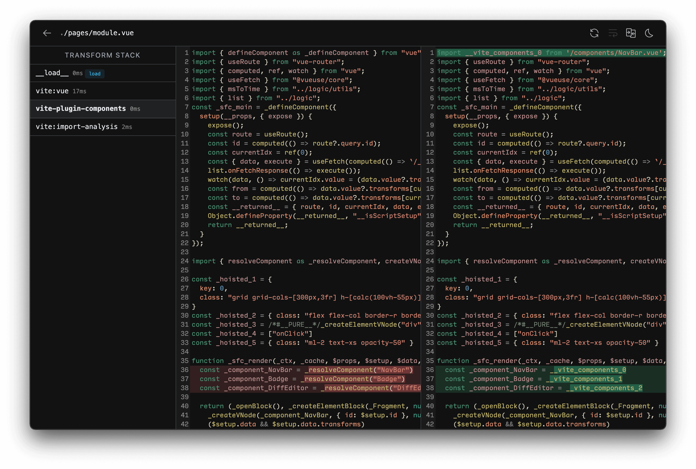

# 플러그인 API {#plugin-api}

Vite 플러그인은 몇 가지 Vite 전용 옵션이 추가된 Rolldown의 플러그인 인터페이스를 확장합니다. 그 결과 Vite 플러그인을 한 번 작성하면 개발과 빌드 모두에서 동작하게 할 수 있습니다.

**아래 섹션을 읽기 전에 먼저 [Rolldown 플러그인 문서](https://rolldown.rs/apis/plugin-api)를 살펴보는 것을 권장합니다.**

## 플러그인 작성하기 {#authoring-a-plugin}

Vite는 기본적으로 검증된 패턴을 제공하려고 합니다. 따라서 새 플러그인을 만들기 전에 먼저 [기능 가이드](/guide/features)를 확인해 필요한 기능이 이미 다뤄지는지 확인하세요. 또한 [호환되는 Rollup 플러그인](https://github.com/rollup/awesome)과 [Vite 전용 플러그인](https://github.com/vitejs/awesome-vite#plugins) 형태로 제공되는 커뮤니티 플러그인도 검토하세요.

플러그인을 만들 때는 `vite.config.js` 안에 인라인으로 작성할 수 있습니다. 이를 위해 새 패키지를 만들 필요는 없습니다. 어떤 플러그인이 여러 프로젝트에서 유용하다는 것을 확인했다면, [생태계](https://chat.vite.dev)의 다른 사람들을 돕기 위해 공유하는 것을 고려해 보세요.

::: tip
플러그인을 학습하거나, 디버깅하거나, 작성할 때는 프로젝트에 [vite-plugin-inspect](https://github.com/antfu/vite-plugin-inspect)를 포함하는 것을 권장합니다. 이 플러그인으로 Vite 플러그인의 중간 상태를 검사할 수 있습니다. 설치 후 `localhost:5173/__inspect/`에 접속하면 프로젝트의 모듈과 변환 스택을 검사할 수 있습니다. 설치 방법은 [vite-plugin-inspect 문서](https://github.com/antfu/vite-plugin-inspect)를 확인하세요.

:::

## 플러그인 작성 규칙 {#conventions}

플러그인이 Vite 전용 훅을 사용하지 않고 [호환되는 Rolldown 플러그인](#rolldown-plugin-compatibility)으로 구현될 수 있다면, [Rolldown 플러그인 명명 규칙](https://rolldown.rs/apis/plugin-api#conventions)을 사용하는 것을 권장합니다.

- Rolldown 플러그인은 `rolldown-plugin-` 접두사를 가진 명확한 이름을 가져야 합니다.
- package.json의 `keywords` 필드에 `rolldown-plugin`과 `vite-plugin` 키워드를 포함하세요.

이렇게 하면 순수 Rolldown 또는 Rollup 기반 프로젝트에서도 플러그인을 사용할 수 있습니다.

Vite 전용 플러그인의 경우:

- Vite 플러그인은 `vite-plugin-` 접두사가 있는 명확한 이름을 갖습니다.
- package.json 파일의 `keywords` 항목에는 `vite-plugin`을 포함시키도록 합니다.
- 플러그인 문서에 Vite 플러그인으로 구성한 이유를 설명하는 섹션을 추가합니다. (가령 'Vite 전용 플러그인 훅 사용'과 같이 말이죠.)

특정 프레임워크에서만 동작하는 플러그인은 접두사에 해당 프레임워크 이름을 포함해야 합니다.

- `vite-plugin-vue-`는 Vue 플러그인을 의미합니다.
- `vite-plugin-react-`는 React만을 지원하는 Vite 플러그인을 의미합니다.
- `vite-plugin-svelte-`는 Svelte만을 지원하는 Vite 플러그인을 의미합니다.

[가상 모듈 컨벤션](#virtual-modules-convention)또한 참고가 가능합니다.

## 플러그인 설정 {#plugins-config}

프로젝트의 `devDependencies`에 플러그인을 추가한 뒤, Vite 설정 파일의 `plugins` 배열 옵션을 사용해 플러그인을 구성할 수 있습니다.

```js [vite.config.js]
import vitePlugin from 'vite-plugin-feature'
import rollupPlugin from 'rollup-plugin-feature'

export default defineConfig({
  plugins: [vitePlugin(), rollupPlugin()],
})
```

거짓으로 평가되는 플러그인은 무시되며, 이를 통해 플러그인을 쉽게 활성화하거나 비활성화할 수 있습니다.

`plugins` 항목은 여러 플러그인을 하나의 요소로 포함할 수도 있습니다. 이는 특정 프레임워크를 타깃으로 여러 플러그인을 사용하는 경우와 같이 복잡한 기능을 구현하는 데 유용합니다. 이 때 플러그인 배열은 자동으로 병합됩니다.

```js
// 프레임워크 플러그인
import frameworkRefresh from 'vite-plugin-framework-refresh'
import frameworkDevtools from 'vite-plugin-framework-devtools'

export default function framework(config) {
  return [frameworkRefresh(config), frameworkDevTools(config)]
}
```

```js [vite.config.js]
import { defineConfig } from 'vite'
import framework from 'vite-plugin-framework'

export default defineConfig({
  plugins: [framework()],
})
```

## 간단한 예제들 {#simple-examples}

:::tip
Vite/Rolldown/Rollup 플러그인은 실제 플러그인 객체를 반환하는 팩토리 함수로 작성하는 것이 일반적인 컨벤션입니다. 이 함수는 사용자가 플러그인의 동작을 커스터마이즈할 수 있도록 옵션을 받을 수 있습니다.
:::

### 파일 타입 변환하기 {#transforming-custom-file-types}

```js
const fileRegex = /\.(my-file-ext)$/

export default function myPlugin() {
  return {
    name: 'transform-file',

    transform: {
      filter: {
        id: fileRegex,
      },
      handler(src, id) {
        return {
          code: compileFileToJS(src),
          map: null, // provide source map if available
        }
      },
    },
  }
}
```

### 가상 모듈 가져오기 {#importing-a-virtual-file}

예제는 [다음 섹션](#virtual-modules-convention)을 참고해주세요.

## 가상 모듈 컨벤션 {#virtual-modules-convention}

가상 모듈은 ESM의 일반적인 `import` 구문을 사용해 소스 파일에 빌드 시의 정보를 전달할 수 있는 유용한 기법입니다.

```js
import { exactRegex } from '@rolldown/pluginutils'

export default function myPlugin() {
  const virtualModuleId = 'virtual:my-module'
  const resolvedVirtualModuleId = '\0' + virtualModuleId

  return {
    name: 'my-plugin', // required, will show up in warnings and errors
    resolveId: {
      filter: { id: exactRegex(virtualModuleId) },
      handler() {
        return resolvedVirtualModuleId
      },
    },
    load: {
      filter: { id: exactRegex(resolvedVirtualModuleId) },
      handler() {
        return `export const msg = "from virtual module"`
      },
    },
  }
}
```

JavaScript에서는 다음과 같이 모듈을 가져올 수 있습니다:

```js
import { msg } from 'virtual:my-module'

console.log(msg)
```

[가상 모듈](https://rollupjs.org/plugin-development/#a-simple-example)은 Vite와 Rolldown / Rollup에서 사용자에게 보이는 경로에 `virtual:` 접두사를 붙이는 컨벤션을 사용합니다. 가능하다면 생태계의 다른 플러그인과 충돌하지 않도록 플러그인 이름을 네임스페이스로 사용해야 합니다. 예를 들어 `vite-plugin-posts`는 사용자가 빌드 시점 정보를 얻기 위해 `virtual:posts` 또는 `virtual:posts/helpers` 가상 모듈을 임포트하도록 할 수 있습니다. 내부적으로 가상 모듈을 사용하는 플러그인은 id를 해석할 때 Rollup 생태계의 컨벤션에 따라 모듈 ID 앞에 `\0`을 붙여야 합니다. 이렇게 하면 다른 플러그인이 해당 id를 노드 해석처럼 처리하려는 것을 방지하고, 소스 맵 같은 핵심 기능이 가상 모듈과 일반 파일을 구분할 수 있습니다. `\0`은 임포트 URL에서 허용되지 않는 문자이므로 임포트 분석 중 대체해야 합니다. 개발 중 브라우저에서는 `\0{id}` 가상 id가 `/@id/__x00__{id}`로 인코딩됩니다. 이 id는 플러그인 파이프라인에 들어가기 전에 다시 디코딩되므로 플러그인 훅 코드에서는 보이지 않습니다.

실제 파일에서 직접 파생된 모듈, 예를 들어 Single File Component(.vue 또는 .svelte SFC)의 스크립트 모듈은 이 컨벤션을 따를 필요가 없습니다. SFC는 일반적으로 처리 과정에서 여러 하위 모듈을 생성하지만, 그 안의 코드는 파일 시스템으로 다시 매핑될 수 있습니다. 이러한 하위 모듈에 `\0`을 사용하면 소스 맵이 올바르게 동작하지 않습니다.

## 범용 훅 {#universal-hooks}

개발 시 Vite 개발 서버는 Rolldown과 동일한 방식으로 [Rolldown 빌드 훅](https://rolldown.rs/apis/plugin-api#build-hooks)을 호출하는 플러그인 컨테이너를 생성합니다.

다음 훅은 서버 시작 시 한 번 호출됩니다:

- [`options`](https://rolldown.rs/reference/interface.plugin#options)
- [`buildStart`](https://rolldown.rs/reference/Interface.Plugin#buildstart)

다음 훅은 들어오는 각 모듈 요청마다 호출됩니다:

- [`resolveId`](https://rolldown.rs/reference/Interface.Plugin#resolveid)
- [`load`](https://rolldown.rs/reference/Interface.Plugin#load)
- [`transform`](https://rolldown.rs/reference/Interface.Plugin#transform)

이 훅들은 Vite 전용 프로퍼티가 추가된 확장 `options` 매개변수도 가집니다. 자세한 내용은 [SSR 문서](/guide/ssr#ssr-specific-plugin-logic)에서 확인할 수 있습니다.

일부 `resolveId` 호출의 `importer` 값은 루트의 일반적인 `index.html`에 대한 절대 경로일 수 있습니다. 이는 Vite의 번들되지 않은 개발 서버 패턴으로 인해 실제 Importer를 도출하는 것이 항상 가능한 것은 아니기 때문입니다. 다만 Vite의 리졸브 파이프라인 내에서 처리되는 Import의 경우, Import 분석 단계에서 Importer를 추적할 수 있기에, 올바른 `importer` 값을 제공할 수 있습니다.

아래의 훅은 서버가 종료될 때 호출됩니다:

- [`buildEnd`](https://rolldown.rs/reference/Interface.Plugin#buildend)
- [`closeBundle`](https://rolldown.rs/reference/Interface.Plugin#closebundle)

[`moduleParsed`](https://rolldown.rs/reference/Interface.Plugin#moduleparsed) 훅은 개발 중 호출되지 않습니다. Vite는 더 나은 성능을 위해 전체 AST 파싱을 피하기 때문입니다.

[Output Generation Hooks](https://rolldown.rs/apis/plugin-api#output-generation-hooks)(`closeBundle` 제외)는 개발 중 호출되지 않습니다.

## Vite 전용 훅 {#vite-specific-hooks}

Vite의 플러그인은 Vite 전용 훅을 사용할 수 있습니다. 물론 이러한 훅은 Rollup에서 무시됩니다.

### `config` {#config}

- **타입:** `(config: UserConfig, env: { mode: string, command: string }) => UserConfig | null | void`
- **종류:** `async`, `sequential`

  훅을 이용해 Vite의 설정을 실제 사용하기 전 변경할 수 있습니다. `config` 훅으로 설정 파일 또는 CLI 옵션으로 전달받은 로우 레벨 사용자 설정 값과, 현재 사용 중인 `mode` 및 `command`가 인자를 통해 전달됩니다. 훅은 객체를 반환할 수 있으며, 이 때의 객체는 기존 설정에 대해 깊은 병합(Deeply merge)이 됩니다. 또는 인자로 전달받은 설정 객체를 직접 수정할 수도 있습니다. 다만 이 방법은 객체 반환을 이용한 방법으로는 원하는 결과를 얻을 수 없을 때만 사용하세요.

  **예제:**

  ```js
  // return partial config (recommended)
  const partialConfigPlugin = () => ({
    name: 'return-partial',
    config: () => ({
      resolve: {
        alias: {
          foo: 'bar',
        },
      },
    }),
  })

  // mutate the config directly (use only when merging doesn't work)
  const mutateConfigPlugin = () => ({
    name: 'mutate-config',
    config(config, { command }) {
      if (command === 'build') {
        config.root = 'foo'
      }
    },
  })
  ```

  ::: warning 참고
  `config` 훅 안에서 다른 플러그인을 사용하지 마세요. 플러그인 자체는 이 훅이 실행되기 전에 모두 확정(Resolve)되며, 따라서 아무런 효과가 없습니다.
  :::

### `configResolved` {#configresolved}

- **타입:** `(config: ResolvedConfig) => void | Promise<void>`
- **종류:** `async`, `parallel`

  Vite 설정 값이 확정된 후 호출되는 훅입니다. 이 훅을 사용하여 최종적으로 확정된 설정 값을 읽거나 저장할 수 있습니다. 특히 플러그인이 실행 중인 명령에 따라 다른 작업을 수행해야 하는 경우 유용합니다.

  **예제:**

  ```js
  const examplePlugin = () => {
    let config

    return {
      name: 'read-config',

      configResolved(resolvedConfig) {
        // store the resolved config
        config = resolvedConfig
      },

      // use stored config in other hooks
      transform(code, id) {
        if (config.command === 'serve') {
          // dev: plugin invoked by dev server
        } else {
          // build: plugin invoked by Rollup
        }
      },
    }
  }
  ```

  참고로 `command` 값은 개발 서버에서 `serve` 입니다(cli에서 `vite`, `vite dev` 및 `vite serve` 모두 별칭입니다).

### `configureServer` {#configureserver}

- **타입:** `(server: ViteDevServer) => (() => void) | void | Promise<(() => void) | void>`
- **종류:** `async`, `sequential`
- **관련 항목:** [ViteDevServer](./api-javascript#vitedevserver)

  개발 서버를 구성하기 위한 훅입니다. 일반적으로 커스텀 미들웨어를 내부의 [connect](https://github.com/senchalabs/connect) 앱에 추가하기 위해 사용합니다:

  ```js
  const myPlugin = () => ({
    name: 'configure-server',
    configureServer(server) {
      server.middlewares.use((req, res, next) => {
        // custom handle request...
      })
    },
  })
  ```

  **내부 미들웨어 설치 이후에 호출되는 커스텀 미들웨어 구성하기**

  `configureServer` 훅은 내부의 미들웨어가 설치되기 전 호출됩니다. 따라서 위와 같은 방식의 커스텀 미들웨어는 내부의 미들웨어보다 먼저 실행됩니다. 만약 내부의 미들웨어가 설치된 **이후에** 커스텀 미들웨어를 호출하고자 한다면, `configureServer`의 반환 값으로 함수를 반환해주세요:

  ```js
  const myPlugin = () => ({
    name: 'configure-server',
    configureServer(server) {
      // return a post hook that is called after internal middlewares are
      // installed
      return () => {
        server.middlewares.use((req, res, next) => {
          // custom handle request...
        })
      }
    },
  })
  ```

  **서버 인스턴스 저장하기**

경우에 따라 다른 플러그인 훅에서 개발 서버 인스턴스에 접근해야 할 수 있습니다(예: WebSocket 서버, 파일 시스템 watcher, 모듈 그래프 접근). 이 훅은 다른 훅에서 접근할 수 있도록 서버 인스턴스를 저장하는 데에도 사용할 수 있습니다:

  ```js
  const myPlugin = () => {
    let server
    return {
      name: 'configure-server',
      configureServer(_server) {
        server = _server
      },
      transform(code, id) {
        if (server) {
          // use server...
        }
      },
    }
  }
  ```

  참고로 `configureServer`는 프로덕션 버전으로 빌드할 때 호출되지 않으므로 위 예시와 같이 훅이 존재하지 않는 경우를 분기해줘야 합니다.

### `configurePreviewServer` {#configurepreviewserver}

- **타입:** `(server: PreviewServer) => (() => void) | void | Promise<(() => void) | void>`
- **종류:** `async`, `sequential`
- **관련 항목:** [PreviewServer](./api-javascript#previewserver)

  [`configureServer`](/guide/api-plugin.html#configureserver)와 같지만 프리뷰 서버에 대한 것입니다. `configureServer`와 마찬가지로 `configurePreviewServer` 훅은 다른 미들웨어가 설치되기 전에 호출됩니다. 만약 다른 미들웨어가 설치된 **이후에** 커스텀 미들웨어를 호출하고자 한다면, `configurePreviewServer`의 반환 값으로 함수를 반환해주세요. 이렇게 하면 내부 미들웨어가 설치된 후에 호출됩니다:

  ```js
  const myPlugin = () => ({
    name: 'configure-preview-server',
    configurePreviewServer(server) {
      // return a post hook that is called after other middlewares are
      // installed
      return () => {
        server.middlewares.use((req, res, next) => {
          // custom handle request...
        })
      }
    },
  })
  ```

### `transformIndexHtml` {#transformindexhtml}

- **타입:** `IndexHtmlTransformHook | { order?: 'pre' | 'post', handler: IndexHtmlTransformHook }`
- **종류:** `async`, `sequential`

  `index.html`과 같은 진입점이 되는 HTML 파일을 변환하기 위한 훅입니다. 훅의 인자로는 HTML 문자열과 컨텍스트를 전달받습니다. 개발 서버의 경우 컨텍스트에 [`ViteDevServer`](./api-javascript#vitedevserver) 인스턴스를 함께 전달하며, 빌드 시에는 Rollup된 번들을 전달합니다.

  훅은 비동기적으로 동작할 수 있으며 다음 중 하나를 반환합니다:
  - 변환된 HTML 문자열
  - 기존 HTML에 추가할 태그 설명자 객체(`{ tag, attrs, children }`) 배열. 각 태그는 기본적으로 `<head>` 앞에 추가되지만, 이 위치를 지정할 수도 있습니다.
  - `{ html, tags }` 둘 다 포함하는 객체

  기본적으로 `order`는 `undefined`이며, HTML이 변환된 이후 훅이 적용됩니다. `order: 'pre'`는 Vite 플러그인 파이프라인을 거쳐야 하는 스크립트를 주입하기 위해 HTML을 변환하기 전 훅을 적용합니다. `order: 'post'`는 `order`가 정의되지 않은 모든 훅이 적용된 후에 훅을 적용합니다.

  **예제:**

  ```js
  const htmlPlugin = () => {
    return {
      name: 'html-transform',
      transformIndexHtml(html) {
        return html.replace(
          /<title>(.*?)<\/title>/,
          `<title>Title replaced!</title>`,
        )
      },
    }
  }
  ```

  **훅 시그니처:**

  ```ts
  type IndexHtmlTransformHook = (
    html: string,
    ctx: {
      path: string
      filename: string
      server?: ViteDevServer
      bundle?: import('rollup').OutputBundle
      chunk?: import('rollup').OutputChunk
    },
  ) =>
    | IndexHtmlTransformResult
    | void
    | Promise<IndexHtmlTransformResult | void>

  type IndexHtmlTransformResult =
    | string
    | HtmlTagDescriptor[]
    | {
        html: string
        tags: HtmlTagDescriptor[]
      }

  interface HtmlTagDescriptor {
    tag: string
    /**
     * attribute values will be escaped automatically if needed
     */
    attrs?: Record<string, string | boolean>
    children?: string | HtmlTagDescriptor[]
    /**
     * default: 'head-prepend'
     */
    injectTo?: 'head' | 'body' | 'head-prepend' | 'body-prepend'
  }
  ```

::: warning 참고
이 훅은 진입점이 되는 파일을 커스텀 처리하는 프레임워크(예: [SvelteKit](https://github.com/sveltejs/kit/discussions/8269#discussioncomment-4509145))를 사용하는 경우 호출되지 않습니다.
:::

### `handleHotUpdate` {#handlehotupdate}

- **타입:** `(ctx: HmrContext) => Array<ModuleNode> | void | Promise<Array<ModuleNode> | void>`
- **종류:** `async`, `sequential`
- **관련 항목:** [HMR API](./api-hmr)

  사용자가 지정한 방식대로 HMR 업데이트를 수행합니다. 이 훅은 아래와 같은 컨텍스트 객체를 전달받습니다:

  ```ts
  interface HmrContext {
    file: string
    timestamp: number
    modules: Array<ModuleNode>
    read: () => string | Promise<string>
    server: ViteDevServer
  }
  ```

  - `modules`는 변경된 파일의 영향을 받는 모듈의 배열입니다. Vue SFC와 같이 단일 파일이 여러 모듈에 매핑될 수 있기 때문에 배열 형태로 제공됩니다.

  - `read`는 파일을 읽어 그 내용을 반환하는 비동기 함수입니다. 일부 시스템에서 핫 리로딩 시 파일 변경 콜백이 너무 이르게 호출되어 `fs.readFile`로 빈 콘텐츠가 반환될 수 있기에(더 자세한 내용은 [hmr.ts](https://github.com/vitejs/vite/blob/5a111cedf31f579e3b8c8af5c4442d2e0cd5aa12/packages/vite/src/node/server/hmr.ts#L443) 파일을 참고해주세요. - 옮긴이), 이 함수를 통해 정상적으로 파일을 읽을 수 있도록 제공하고 있습니다.

  이 훅은 다음 동작을 할 수 있습니다:
  - 영향을 받는 모듈 목록을 필터링하고 범위를 좁혀 더 정확하게 HMR이 동작하도록 구성

  - 빈 배열을 반환하고 전체 리로드를 수행:

    ```js
    handleHotUpdate({ server, modules, timestamp }) {
      // Invalidate modules manually
      const invalidatedModules = new Set()
      for (const mod of modules) {
        server.moduleGraph.invalidateModule(
          mod,
          invalidatedModules,
          timestamp,
          true
        )
      }
      server.ws.send({ type: 'full-reload' })
      return []
    }
    ```

  - 빈 배열을 반환하고 클라이언트에게 커스텀 이벤트를 전송하여, 완전한 커스텀 HMR 처리를 수행:

    ```js
    handleHotUpdate({ server }) {
      server.ws.send({
        type: 'custom',
        event: 'special-update',
        data: {}
      })
      return []
    }
    ```

    위 커스텀 이벤트는 [HMR API](./api-hmr)를 사용하여 핸들러를 등록해야 합니다(이는 동일한 플러그인의 `transform` 훅에 주입될 수 있습니다):

    ```js
    if (import.meta.hot) {
      import.meta.hot.on('special-update', (data) => {
        // perform custom update
      })
    }
    ```

## 플러그인 컨텍스트 메타 {#plugin-context-meta}

플러그인 컨텍스트에 접근할 수 있는 플러그인 훅의 경우, Vite는 `this.meta`에 추가 프로퍼티를 노출합니다:

- `this.meta.viteVersion`: 현재 Vite 버전 문자열입니다(예: `"8.0.0"`).

::: tip Rolldown 기반 Vite 감지하기

[`this.meta.rolldownVersion`](https://rolldown.rs/reference/Interface.PluginContextMeta#rolldownversion)은 Rolldown 기반 Vite(즉 Vite 8+)에서만 사용할 수 있습니다. 이를 사용해 현재 Vite 인스턴스가 Rolldown 기반인지 감지할 수 있습니다:

```ts
function versionCheckPlugin(): Plugin {
  return {
    name: 'version-check',
    buildStart() {
      if (this.meta.rolldownVersion) {
        // Rolldown 기반 Vite에서 실행 중일 때만 작업합니다.
      } else {
        // Rollup 기반 Vite에서 실행 중이면 다른 작업을 합니다.
      }
    },
  }
}
```

:::

## 출력 번들 메타데이터 {#output-bundle-metadata}

빌드 중 Vite는 Rolldown의 빌드 출력 객체에 Vite 전용 `viteMetadata` 필드를 추가합니다.

이는 다음을 통해 사용할 수 있습니다:

- `RenderedChunk`(예: `renderChunk`와 `augmentChunkHash`에서)
- `OutputChunk`와 `OutputAsset`(예: `generateBundle`과 `writeBundle`에서)

`viteMetadata` provides:

- `viteMetadata.importedCss: Set<string>`
- `viteMetadata.importedAssets: Set<string>`

이는 [`build.manifest`](/config/build-options#build-manifest)에 의존하지 않고 방출된 CSS와 정적 에셋을 검사해야 하는 플러그인을 작성할 때 유용합니다.

예시:

```ts [vite.config.ts]
function outputMetadataPlugin(): Plugin {
  return {
    name: 'output-metadata-plugin',
    generateBundle(_, bundle) {
      for (const output of Object.values(bundle)) {
        const css = output.viteMetadata?.importedCss
        const assets = output.viteMetadata?.importedAssets
        if (!css?.size && !assets?.size) continue

        console.log(output.fileName, {
          css: css ? [...css] : [],
          assets: assets ? [...assets] : [],
        })
      }
    },
  }
}
```

## 플러그인 순서 {#plugin-ordering}

Vite 플러그인은 Webpack 로더와 유사한 `enforce` 프로퍼티를 추가적으로 지정하여 플러그인 애플리케이션의 순서를 조정할 수 있습니다. `enforce` 값은 `"pre"` 또는 `"post"`로 지정할 수 있으며, 이를 통해 지정되는 플러그인 순서는 다음과 같습니다:

- 별칭
- `enforce: 'pre'`로 지정된 플러그인
- Vite 코어 플러그인
- enforce 값이 존재하지 않는 플러그인
- Vite 빌드 플러그인
- `enforce: 'post'`로 지정된 플러그인
- 빌드 후 실행되는 Vite의 플러그인 (minify, manifest, reporting)

이는 훅 순서와는 별개입니다. Rolldown 훅은 평소처럼 [`order` 속성](https://rolldown.rs/reference/TypeAlias.ObjectHook#order)의 영향을 별도로 받습니다.

## 조건부 적용 {#conditional-application}

기본적으로 플러그인은 개발 서버 및 빌드 시 모두 호출됩니다. 만약 플러그인이 개발 조건부로 호출되어야 하는 경우, `apply` 프로퍼티를 사용하여 `'build'` 또는 `'serve'` 중에만 플러그인이 호출되도록 구성해주세요:

```js
function myPlugin() {
  return {
    name: 'build-only',
    apply: 'build', // or 'serve'
  }
}
```

보다 정확한 제어를 위해 함수를 사용할 수도 있습니다:

```js
apply(config, { command }) {
  // SSR이 아닌 빌드에만 적용합니다.
  return command === 'build' && !config.build.ssr
}
```

## Rolldown 플러그인 호환성 {#rolldown-plugin-compatibility}

상당수 Rolldown / Rollup 플러그인은 Vite 플러그인으로 바로 동작합니다(예: `@rollup/plugin-alias` 또는 `@rollup/plugin-json`). 하지만 번들링되지 않은 개발 서버 컨텍스트에서는 일부 플러그인 훅이 의미가 없기 때문에, 모든 플러그인이 동작하는 것은 아닙니다.

일반적으로 Rolldown / Rollup 플러그인이 다음 기준을 충족한다면 Vite 플러그인으로 동작해야 합니다:

- [`moduleParsed`](https://rolldown.rs/reference/Interface.Plugin#moduleparsed) 훅을 사용하지 않습니다.
- [`transform.inject`](https://rolldown.rs/reference/InputOptions.transform#inject) 같은 Rolldown 전용 옵션에 의존하지 않습니다.
- 번들 단계 훅과 출력 단계 훅 사이에 강한 결합이 없습니다.

Rolldown / Rollup 플러그인이 빌드 단계에서만 의미가 있다면, 대신 `build.rolldownOptions.plugins` 아래에 지정할 수 있습니다. 이는 `enforce: 'post'`와 `apply: 'build'`가 있는 Vite 플러그인과 동일하게 동작합니다.

기존 Rolldown / Rollup 플러그인에 Vite 전용 프로퍼티를 추가할 수도 있습니다:

```js [vite.config.js]
import example from 'rolldown-plugin-example'
import { defineConfig } from 'vite'

export default defineConfig({
  plugins: [
    {
      ...example(),
      enforce: 'post',
      apply: 'build',
    },
  ],
})
```

## 경로 정규화 {#path-normalization}

Vite는 Windows에서도 POSIX 구분 기호( / )를 사용할 수 있도록 파일의 ID를 확인할 때 경로를 같이 정규화합니다. 반면 Rollup은 기본적으로 파일의 경로를 그대로 유지하기에, Windows에서 파일의 ID는 win32 구분 기호( \\ )를 포함하고 있습니다. 따라서 Rollup 플러그인은 이 구분 기호를 POSIX로 변환하는 `@rollup/pluginutils`의 [`normalizePath` 유틸리티 함수](https://github.com/rollup/plugins/tree/master/packages/pluginutils#normalizepath)를 사용합니다. 이 덕분에 Rollup 플러그인이 Vite에서 사용될 때도 파일의 ID에 대한 `include` 및 `exclude` 패턴과 비슷한 경로 관련 작업이 올바르게 동작합니다.

따라서 만약 새로이 Vite 플러그인을 작성하는 경우, 파일의 ID와 실제 경로를 비교할 때 먼저 POSIX 구분 기호를 사용하도록 경로를 정규화해줘야 합니다. 이는 `vite` 모듈의 `normalizePath` 유틸리티 함수를 이용할 수 있습니다.

```js
import { normalizePath } from 'vite'

normalizePath('foo\\bar') // 'foo/bar'
normalizePath('foo/bar') // 'foo/bar'
```

## 필터링, include/exclude 패턴 {#filtering-include-exclude-pattern}

Vite는 Vite 전용 플러그인 및 통합(Integration)이 표준 포함(Include)/제외(Exclude) 필터링 패턴을 사용하도록 [`@rollup/pluginutils`의 `createFilter`](https://github.com/rollup/plugins/tree/master/packages/pluginutils#createfilter) 함수를 제공하고 있습니다. 참고로 이 방식은 Vite 코어 자체에서도 사용합니다.

### 훅 필터 {#hook-filters}

Rolldown은 Rust와 JavaScript 런타임 사이의 통신 오버헤드를 줄이기 위해 [훅 필터 기능](https://rolldown.rs/apis/plugin-api/hook-filters)을 도입했습니다. 이 기능을 통해 플러그인은 훅이 호출되어야 하는 시점을 결정하는 패턴을 지정할 수 있으며, 불필요한 훅 호출을 피해서 성능을 개선합니다.

이는 Rollup 4.38.0+와 Vite 6.3.0+에서도 지원됩니다. 플러그인이 이전 버전과 하위 호환되도록 하려면, 훅 핸들러 내부에서도 필터를 실행해야 합니다.

```js
export default function myPlugin() {
  const jsFileRegex = /\.js$/

  return {
    name: 'my-plugin',
    // 예: .js 파일에 대해서만 transform을 호출합니다.
    transform: {
      filter: {
        id: jsFileRegex,
      },
      handler(code, id) {
        // 하위 호환성을 위한 추가 검사
        if (!jsFileRegex.test(id)) return null

        return {
          code: transformCode(code),
          map: null,
        }
      },
    },
  }
}
```

::: tip
[`@rolldown/pluginutils`](https://www.npmjs.com/package/@rolldown/pluginutils)는 `exactRegex`와 `prefixRegex` 같은 훅 필터용 유틸리티를 익스포트합니다. 편의를 위해 이 유틸리티들은 `rolldown/filter`에서도 다시 익스포트됩니다.
:::

## 클라이언트-서버 커뮤니케이션 {#client-server-communication}

Vite 2.9부터 클라이언트와의 통신을 처리하는 데 도움이 되는 플러그인용 유틸을 제공합니다.

### 서버에서 클라이언트로 전송 {#server-to-client}

플러그인 측에서는 `server.ws.send`를 사용해 이벤트를 클라이언트에게 브로드캐스트 할 수 있습니다:

```js [vite.config.js]
export default defineConfig({
  plugins: [
    {
      // ...
      configureServer(server) {
        server.ws.on('connection', () => {
          server.ws.send('my:greetings', { msg: 'hello' })
        })
      },
    },
  ],
})
```

::: tip 참고
다른 플러그인과의 충돌을 피하기 위해 이벤트 이름에 **항상 접두사를 붙이는 것** 이 좋습니다.
:::

클라이언트 측에서는 [`hot.on`](/guide/api-hmr.html#hot-on-event-cb)을 사용해 이벤트를 수신할 수 있습니다:

```ts twoslash
import 'vite/client'
// ---cut---
// 클라이언트 측
if (import.meta.hot) {
  import.meta.hot.on('my:greetings', (data) => {
    console.log(data.msg) // hello
  })
}
```

### 클라이언트에서 서버로 전송 {#client-to-server}

클라이언트에서 서버로 이벤트를 보낼 때는 [`hot.send`](/guide/api-hmr.html#hot-send-event-payload)를 사용할 수 있습니다:

```ts
// 클라이언트 측
if (import.meta.hot) {
  import.meta.hot.send('my:from-client', { msg: 'Hey!' })
}
```

서버에서는 `server.ws.on`을 사용해 이벤트를 수신합니다:

```js [vite.config.js]
export default defineConfig({
  plugins: [
    {
      // ...
      configureServer(server) {
        server.ws.on('my:from-client', (data, client) => {
          console.log('Message from client:', data.msg) // Hey!
          // 필요한 경우 해당 클라이언트에만 응답합니다.
          client.send('my:ack', { msg: 'Hi! I got your message!' })
        })
      },
    },
  ],
})
```

### 커스텀 이벤트 타입 정의 {#typescript-for-custom-events}

내부적으로 Vite는 `CustomEventMap` 인터페이스를 통해 페이로드 타입을 추론합니다. 이 인터페이스를 확장해 커스텀 이벤트 타입을 정의할 수 있습니다.

:::tip 참고
TypeScript 선언 파일을 가져올 때 `.d.ts` 확장자를 포함해야 합니다. 그렇지 않으면 확장하려는 모듈이 어떤 파일에 존재하는지 TypeScript가 알지 못할 수 있습니다.
:::

```ts [events.d.ts]
import 'vite/types/customEvent.d.ts'

declare module 'vite/types/customEvent.d.ts' {
  interface CustomEventMap {
    'custom:foo': { msg: string }
    // 'event-key': 페이로드
  }
}
```

이 인터페이스 확장은 `InferCustomEventPayload<T>`에서 이벤트 `T`에 대한 페이로드 타입을 추론하는 데 사용됩니다. 이 인터페이스가 어떻게 활용되는지에 대한 자세한 내용은 [HMR API 문서](./api-hmr#hmr-api)를 참고해 주세요.

```ts twoslash
import 'vite/client'
import type { InferCustomEventPayload } from 'vite/types/customEvent.d.ts'
declare module 'vite/types/customEvent.d.ts' {
  interface CustomEventMap {
    'custom:foo': { msg: string }
  }
}
// ---cut---
type CustomFooPayload = InferCustomEventPayload<'custom:foo'>
import.meta.hot?.on('custom:foo', (payload) => {
  // payload 타입은 { msg: string }입니다.
})
import.meta.hot?.on('unknown:event', (payload) => {
  // payload 타입은 any입니다.
})
```
